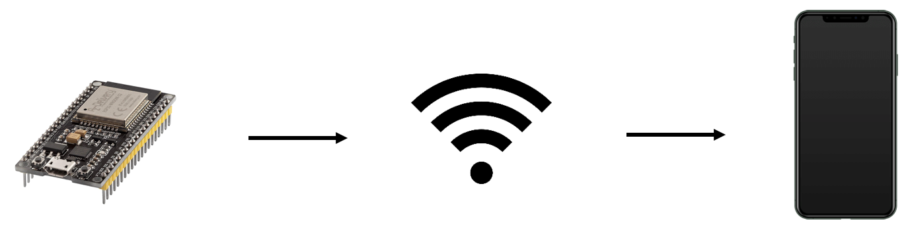
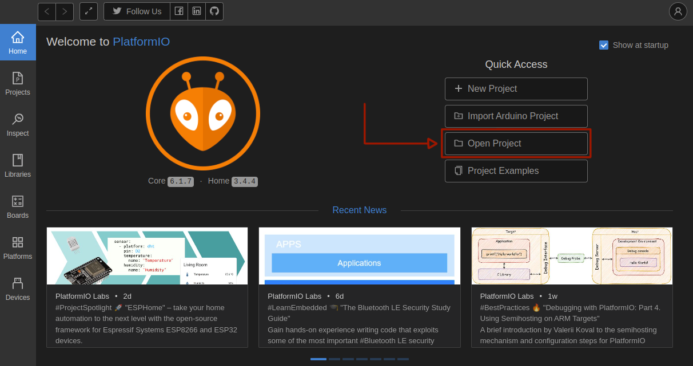
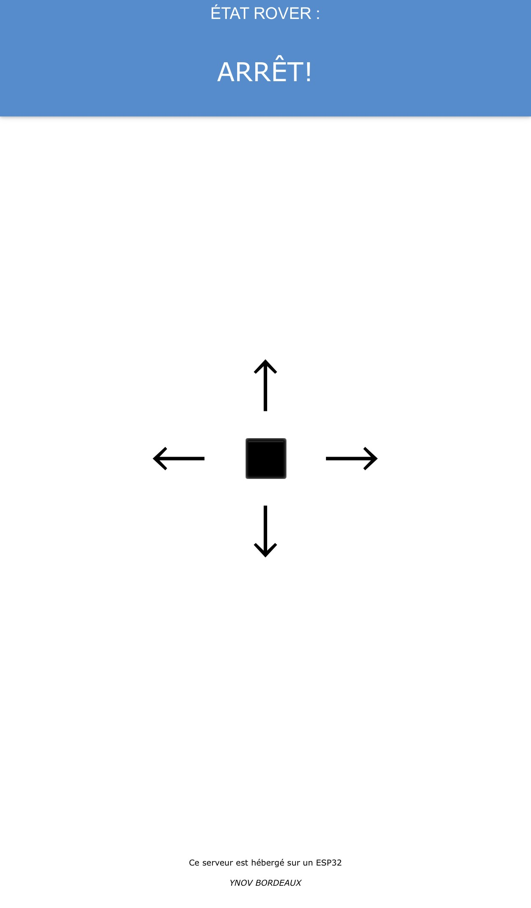
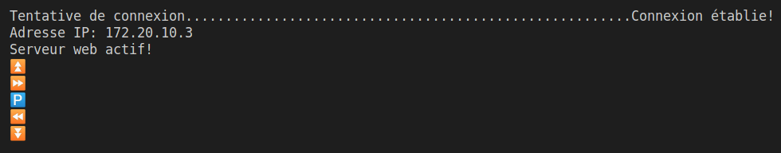
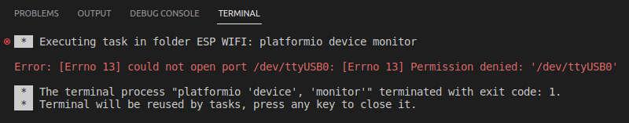

<div id="top"></div>

# ESP Controller

<details>
  <summary>Table des matières</summary>
  <ol>
    <li>
      <a href="#Présentation">Présentation</a>
    </li>
    <li>
      <a href="#Installation ">Installation</a>
    </li>
    <li>
      <a href="#Résultats ">Résultats</a>
    </li>
    <li>
      <a href="#Plus ">Plus</a>
    </li>
  </ol>
</details>

## Présentation

Ce projet a pour objectif de tester la carte dans sa globalité en l'utilisant comme on le ferait pour un projet d'école. Nous allons utiliser l'ESP32 pour contrôler une voiture radiocommandée / Rover. Étant donné que nous n'avons pas le temps de concevoir une voiture RC, nous simulerons ses mouvements dans un terminal. Nous aurons ainsi la possibilité de contrôler la voiture RC à distance à l'aide d'un téléphone portable, en établissant une connexion Wi-Fi entre l'ESP32 et le téléphone. Cela nous offrira une interface utilisateur conviviale et permettra de visualiser l'état du voiture RC en temps réel. Le système sera composé de l'ESP32, qui sera utilisé comme microcontrôleur et point d'accès Wi-Fi, et d'un téléphone portable. Le téléphone portable servira à établir un partage de connexion, fournissant ainsi un réseau Wi-Fi auquel l'ESP32 se connectera. 

<div>
    
  </br></br>
</div>

L'ESP32 hébergera ensuite une page web intégrée qui affichera l'état de la voiture RC, ainsi que des commandes de direction comprenant quatre flèches (haut, bas, gauche, droite) et un bouton d'arrêt pour immobiliser le véhicule.


## Installation 

Pour installer le programme, vous pouvez cloner le dépôt git :

```
$ git clone https://gitlab.ausy.com/ausy/embedded-bdx-rd/drone.git
```

Ensuite, aller à l'emplacement du fichier et ouvrez le avec VS Code :

```
$ code Test_ESP32
```
Ou ouvrez le projet depuis l'accueil de PlatformIO :

<div>
    
  </br></br>
</div>

## Résultats 

Vous pouvez maintenant déplacer le rover à l'aide de votre smartphone, en vous aidant des flèches directionnelles :

<div>
    
  </br></br>
</div>


Un moniteur série est mis à disposition pour afficher les déplacements du véhicule en temps réel :

<div>
    
  </br></br>
</div>

⏫ : Le véhicule avance

⏬ : Le véhicule recule

⏩ : Le véhicule tourne à droite

⏪ : Le véhicule tourne à gauche

🅿️ : Le véhicule est à l'arrêt 

## Plus

Erreur de permission lors de la téléversement du code sur l'ESP32 : Comment résoudre le problème ?

Lors du téléversement du code sur l'ESP32, il peut arriver que vous rencontriez une erreur du type "could not open port /dev/ttyUSB0; permissions denied". Cette erreur se produit généralement en raison de problèmes de permission qui empêchent l'accès au port série utilisé pour communiquer avec l'ESP32. Heureusement, il existe une solution simple pour contourner cette erreur.

<div>
    
  </br></br>
</div>

Voici les étapes à suivre pour résoudre le problème de permission :

Ouvrez un terminal sur votre système d'exploitation.
Tapez la commande suivante : 
```
$ sudo usermod -a -G dialout $USER.
```
"**sudo**" est utilisé pour exécuter la commande avec des privilèges administratifs.

"**usermod**" est la commande pour modifier les paramètres de l'utilisateur.

"**-a**" indique que nous ajoutons un groupe supplémentaire à l'utilisateur.

"**-G**" dialout spécifie que nous ajoutons l'utilisateur au groupe "dialout", qui est généralement associé aux ports série.

"**$USER**" représente le nom de l'utilisateur actuel.

Appuyez sur Entrée et entrez le mot de passe administrateur si cela vous est demandé.
Après avoir exécuté cette commande, vous devriez pouvoir accéder au port série sans rencontrer l'erreur de permission.

En ajoutant votre utilisateur au groupe "dialout", vous lui donnez les permissions nécessaires pour accéder aux ports série, ce qui permet de résoudre l'erreur de permission lors du téléversement du code sur l'ESP32.
En suivant ces étapes, vous devriez pouvoir contourner l'erreur de permission lors du téléversement du code sur l'ESP32 et poursuivre le développement de votre projet en toute fluidité.
